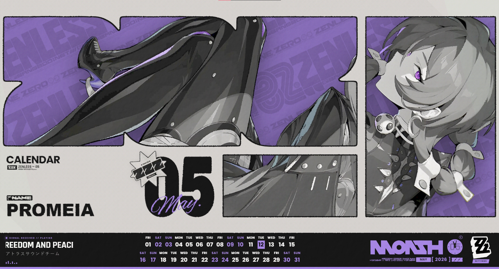

# ZenlessWallpaper

A **Zenless Zone Zero** themed web wallpaper for **Wallpaper Engine**.

*The design and concept are based on the [Zenless Zone Zero promotional art/UI](https://x.com/ZZZ_EN/status/2027964547999371359).*

All characters and related assets are property of their respective owners.

- **Developer**: [miHoYo Co., Ltd.](https://www.mihoyo.com/)
- **Global Publisher**: [HoYoverse (Cognosphere Pte., Ltd.)](https://www.hoyoverse.com/)
- **Zenless Font**: [Zenless](assets/fonts/Zenless_Font.ttf) (Custom Game Font)
- **ZZZ Glyphs Font**: [HoYo-Glyphs by SpeedyOrc-C](https://github.com/SpeedyOrc-C/HoYo-Glyphs)
- **Characters' Name & Faction**: [AbrilFatface](https://fonts.google.com/specimen/Abril+Fatface)
- **Primary Interface**: [Rajdhani](https://fonts.google.com/specimen/Rajdhani)
- **Decorative Accent**: [OctinCollege](https://www.dafont.com/octin-college.font)
- **Handwritten Accent**: [Parisienne](https://fonts.google.com/specimen/Parisienne)
- **Bold Display**: [RubikMonoOne](https://fonts.google.com/specimen/Rubik+Mono+One)
- **General Text**: [Arimo](https://fonts.google.com/specimen/Arimo)
- **All ZZZ Resources**: Images, logos, and related assets are sourced from official ZZZ media.